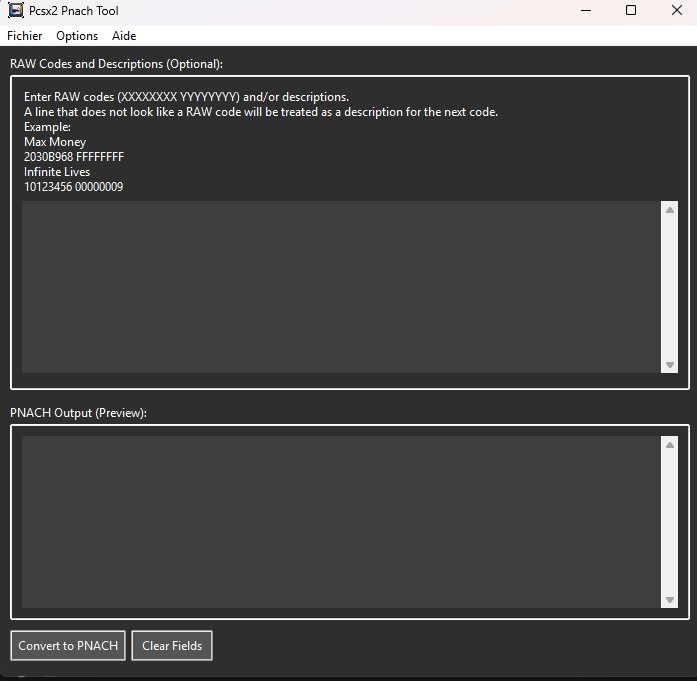

# Pcsx2 Pnach Tool (Version Tkinter)



## Description

**Pcsx2 Pnach Tool (Tkinter)** est une application de bureau simple conçue pour aider les utilisateurs à convertir des codes de triche bruts (RAW) pour les jeux PlayStation 2 au format PNACH, compatible avec l'émulateur PCSX2. L'outil permet également d'ajouter des descriptions aux codes pour une meilleure organisation.

Cette version utilise la bibliothèque Tkinter pour son interface utilisateur, offrant une alternative légère à la version PySide6.

## Fonctionnalités

*   Conversion de codes RAW PS2 (format `XXXXXXXX YYYYYYYY`) en format PNACH (`patch=1,EE,XXXXXXXX,extended,YYYYYYYY`).
*   Prise en charge de l'ajout de descriptions pour chaque code ou groupe de codes.
*   Interface utilisateur intuitive avec des champs d'entrée et de sortie clairs.
*   Génération automatique des en-têtes `gametitle` et `comment` pour le fichier PNACH.
*   Demande du nom du jeu et du CRC du jeu lors de l'enregistrement pour nommer correctement le fichier PNACH.
*   Validation basique du format du CRC.

## Comment utiliser

1.  **Lancer l'application** : Exécutez le script `pcsx2_pnach_tool_tk.py`.
2.  **Saisir les codes** :
    *   Dans la zone de texte "Codes RAW et Descriptions (Optionnel)", collez vos codes RAW. Chaque code doit être sur une nouvelle ligne au format `XXXXXXXX YYYYYYYY` (par exemple, `2030B968 FFFFFFFF`).
    *   Pour ajouter une description à un code, écrivez la description sur la ligne précédant le code. Toute ligne qui n'est pas reconnue comme un code RAW valide sera traitée comme une description pour le code suivant.
    *   Exemple :
        ```
        Max Argent
        2030B968 FFFFFFFF
        Vies Infinies
        10123456 00000009
        ```
3.  **Convertir** : Cliquez sur le bouton "Convertir en PNACH".
4.  **Prévisualiser** : La sortie au format PNACH apparaîtra dans la zone "Sortie PNACH (Prévisualisation)".
5.  **Enregistrer** :
    *   Allez dans `Fichier -> Enregistrer PNACH sous...`.
    *   L'application vous demandera d'entrer le **nom du jeu** et le **CRC hexadécimal à 8 chiffres** du jeu. Ces informations sont utilisées pour le contenu du fichier PNACH et pour suggérer un nom de fichier (par exemple, `A1B2C3D4.pnach`).
    *   Choisissez l'emplacement et enregistrez le fichier.
6.  **Effacer** : Utilisez le bouton "Effacer les champs" pour réinitialiser les zones de texte d'entrée et de sortie.


## Dépendances

*   **Python**
*   **Tkinter** (généralement inclus avec les installations standard de Python)

## Comment lancer l'application

1.  Assurez-vous d'avoir Python installé sur votre système.
2.  Clonez ou téléchargez ce dépôt.
3.  Naviguez jusqu'au répertoire où se trouve `pcsx2_pnach_tool_tk.py`.
4.  Exécutez la commande :
    ```bash
    python pcsx2_pnach_tool_tk.py
    ```

## Licence

Ce projet est sous licence GNU General Public License v3.0. Le fichier `LICENSE` complet se trouve à la racine du projet principal.

## Auteur

*   Concept original et version PySide6 : Paynssj4


